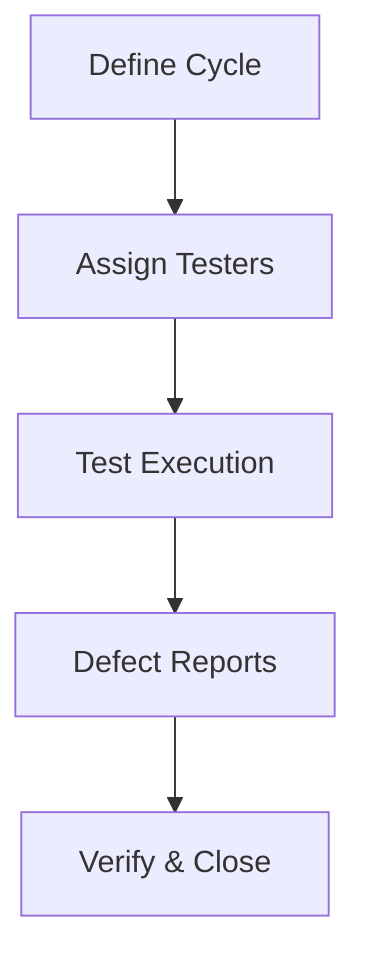

## Overview

Test IO delivers comprehensive quality assurance through crowdtesting and managed services. You access a global community of over 400k testers for real-world validation across devices and platforms. These features enable agile teams to ship reliable software faster.

<Callout kind="info">
  Test IO integrates seamlessly into your CI/CD pipeline, providing on-demand testing without infrastructure overhead.
</Callout>

## Key Features

Explore the core capabilities that power your QA strategy.

<Columns cols={3}>
  <Card title="Crowdtesting" icon="users" href="#crowdtesting">
    Leverage 400k+ diverse testers worldwide for exploratory testing.
  </Card>
  <Card title="Managed QA" icon="settings" href="#managed-qa">
    Fully managed services tailored for agile sprints.
  </Card>
  <Card title="Multi-Platform Testing" icon="smartphone" href="#multi-platform">
    Coverage for web, mobile, and desktop applications.
  </Card>
  <Card title="Real-Time Reporting" icon="bar-chart" href="#reporting">
    Instant defect insights and analytics.
  </Card>
  <Card title="Scalable Testing" icon="trending-up" href="#scalable">
    Handle projects from MVPs to enterprise-scale.
  </Card>
</Columns>

## Crowdtesting

Harness a global tester community for unbiased, real-world feedback.

<Steps>
  <Step title="Define Test Cycles" icon="edit-3">
    Specify your app version, platforms, and scenarios via the dashboard.
  </Step>
  <Step title="Assign Testers" icon="users">
    Test IO matches your project with skilled testers from 140+ countries.
  </Step>
  <Step title="Review Results" icon="check-circle">
    Receive detailed bug reports with screenshots and videos in hours.
  </Step>
</Steps>



## Managed QA Services

You focus on development while Test IO handles end-to-end QA.

<Callout kind="tip">
  Ideal for agile teams: integrate testing into every sprint with dedicated QA managers.
</Callout>

Services include test planning, execution, and triage, ensuring zero backlog.

## Application Testing

Test across platforms with comprehensive coverage.

<Tabs>
  <Tab title="Web" icon="globe">
    Browser compatibility testing on Chrome, Firefox, Safari, and Edge.
    
    ```javascript
    // Example: Automate web test submission via API
    const submitTestCycle = async () => {
      const response = await fetch('https://api.example.com/v1/test-cycles', {
        method: 'POST',
        headers: { 'Authorization': 'Bearer YOUR_API_KEY' },
        body: JSON.stringify({
          appUrl: 'https://yourapp.com',
          browsers: ['chrome', 'firefox']
        })
      });
      return response.json();
    };
    ```
  </Tab>
  <Tab title="Mobile" icon="smartphone">
    iOS and Android testing on real devices, including edge cases like low battery.
    
    ```javascript
    // Mobile test cycle configuration
    const mobileCycle = {
      platforms: ['ios', 'android'],
      devices: ['iPhone 14', 'Samsung Galaxy S23'],
      appType: 'native'
    };
    ```
  </Tab>
  <Tab title="Desktop" icon="monitor">
    Cross-OS validation for Windows, macOS, and Linux apps.
    
    ```javascript
    // Desktop app testing payload
    const desktopPayload = {
      os: ['windows', 'macos'],
      appPath: '/path/to/your-desktop-app.exe'
    };
    ```
  </Tab>
</Tabs>

## Real-Time Reporting and Defect Management

Track defects instantly with customizable dashboards.

<CodeGroup tabs="JavaScript,Python">
  ```javascript
  // Fetch defects via API
  const getDefects = async (cycleId) => {
    const res = await fetch(`https://api.example.com/v1/cycles/${cycleId}/defects`);
    const defects = await res.json();
    console.log(defects); // { id: 123, severity: 'high', steps: '...' }
  };
  ```
  ```python
  # Python defect retrieval
  import requests
  response = requests.get(
    'https://api.example.com/v1/cycles/123/defects',
    headers={'Authorization': 'Bearer YOUR_API_KEY'}
  )
  defects = response.json()
  print(defects)
  ```
</CodeGroup>

| Feature | Benefit |
|---------|---------|
| Live Dashboards | Monitor progress in real-time |
| Severity Triage | Prioritize critical bugs |
| Integrations | Jira, Slack, GitHub |

## Scalable Testing

<Expandable title="Scale for High-Volume Projects" default-open="false">
  Test IO auto-scales tester pools for peak loads, supporting thousands of concurrent tests. Configure via API for dynamic capacity.
  
  ```bash
  curl -X POST https://api.example.com/v1/scaling \
    -H "Authorization: Bearer YOUR_API_KEY" \
    -d '{"maxTesters": 5000, "projectId": "proj-123"}'
  ```
</Expandable>

<Columns cols={2}>
  <Card title="Get Started" icon="rocket" href="/quickstart">
    Launch your first test cycle.
  </Card>
  <Card title="Contact Sales" icon="message-circle" href="https://test.io/contact" target="_blank">
    Discuss enterprise scaling.
  </Card>
</Columns>