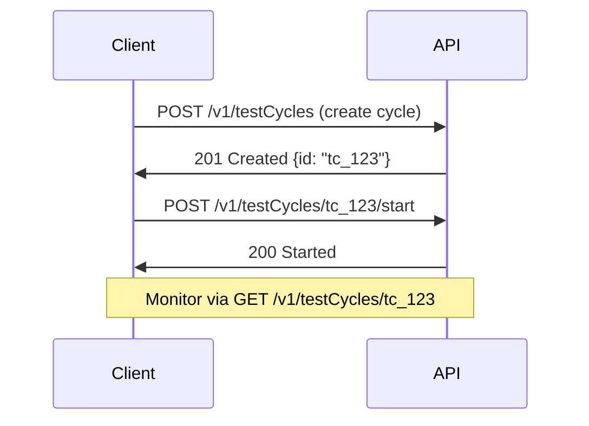

## Overview

Integrate Test IO into your workflow to automate test cycles, receive real-time notifications, and streamline quality assurance. Use the RESTful API at `https://api.example.com` for programmatic access, configure webhooks for event-driven updates, and connect with CI/CD tools like Jenkins or issue trackers like Jira. These integrations enable agile teams to maintain velocity while ensuring high-quality releases.

<Callout kind="info">
  Obtain your `{API_KEY}` from the Test IO dashboard at `https://dashboard.example.com/account/api`.
</Callout>

## API Integrations for Test Cycle Automation

Access Test IO endpoints to create, start, and monitor test cycles programmatically. Authenticate requests with a Bearer token in the `Authorization` header.

<ParamField header="Authorization" param-type="string" required="true">
  Bearer `{YOUR_API_KEY}`.
</ParamField>

<ParamField path="testCycles" param-type="string" required="false">
  ID of the test cycle to manage.
</ParamField>



<Request tabs="JavaScript,cURL" show-lines="true">
```javascript
const response = await fetch('https://api.example.com/v1/testCycles', {
  method: 'POST',
  headers: {
    'Authorization': 'Bearer YOUR_API_KEY',
    'Content-Type': 'application/json'
  },
  body: JSON.stringify({
    name: 'Regression Suite',
    projectId: 'proj_456'
  })
});
```

````bash
curl -X POST https://api.example.com/v1/testCycles \
  -H "Authorization: Bearer YOUR_API_KEY" \
  -H "Content-Type: application/json" \
  -d '{
    "name": "Regression Suite",
    "projectId": "proj_456"
  }'
````
</Request>

<Response tabs="201">
```json
{
  "id": "tc_123",
  "name": "Regression Suite",
  "status": "created",
  "createdAt": "2024-10-15T10:00:00Z"
}
```
</Response>

## Webhook Configurations

Set up webhooks to receive notifications for test cycle events like completion or failures. Configure them in your Test IO dashboard.

<Steps>
  <Step title="Create Webhook" icon="settings">
    Navigate to `https://dashboard.example.com/project/{projectId}/webhooks`.
    
    Specify your endpoint: `https://your-webhook-url.com/webhook`.
  </Step>
  <Step title="Select Events" icon="zap">
    Choose events: `testCycle.completed`, `testCycle.failed`.
  </Step>
  <Step title="Test Delivery" icon="play">
    Use the Test button to verify payload delivery.
  </Step>
</Steps>

Example payload for a completed cycle:

<CodeGroup tabs="JavaScript,Python">
```javascript
app.post('/webhook', (req, res) => {
  const event = req.headers['x-testio-event'];
  const data = req.body;
  
  if (event === 'testCycle.completed') {
    console.log(`Cycle ${data.id} completed: ${data.results.passed}/${data.results.total}`);
  }
  
  res.status(200).send('OK');
});
```

```python
from flask import Flask, request

app = Flask(__name__)

@app.route('/webhook', methods=['POST'])
def webhook():
    event = request.headers.get('X-TestIO-Event')
    data = request.json
    
    if event == 'testCycle.completed':
        print(f"Cycle {data['id']} completed: {data['results']['passed']}/{data['results']['total']}")
    
    return 'OK', 200
```
</CodeGroup>

## CI/CD Pipeline Integrations

Embed Test IO into your CI/CD workflows for automated testing.

<Tabs>
  <Tab title="Jenkins" icon="plug">
    Add a pipeline stage to trigger test cycles.
    
````groovy
pipeline {
  agent any
  stages {
    stage('Test IO Cycle') {
      steps {
        script {
          sh '''
            curl -X POST https://api.example.com/v1/testCycles \\
              -H "Authorization: Bearer ${TESTIO_API_KEY}" \\
              -d \'{"name": "CI Build Tests", "projectId": "${PROJECT_ID}"}\'
          '''
        }
      }
    }
  }
}
````
    
    <Callout kind="tip">
      Store `{TESTIO_API_KEY}` as a Jenkins secret.
    </Callout>
  </Tab>
  <Tab title="GitHub Actions" icon="github">
    Use the official action for seamless integration.
    
````yaml
- name: Run Test IO Cycle
  uses: testio/action@test-cycle@v1
  with:
    api-key: ${{ secrets.TESTIO_API_KEY }}
    project-id: proj_456
````
  </Tab>
</Tabs>

## Third-Party Tool Compatibility

Connect Test IO with popular tools using native integrations or Zapier.

<Columns cols={2}>
  <Card title="Jira" icon="github" href="https://dashboard.example.com/integrations/jira">
    Sync test results as Jira issues. Map cycles to epics automatically.
  </Card>
  <Card title="Slack" icon="message-circle" href="https://dashboard.example.com/integrations/slack">
    Get notifications in channels for test completions and failures.
  </Card>
</Columns>

## Custom Extensions for Enterprise

For advanced needs, build custom extensions using Test IO's SDK.

<Expandable title="SDK Installation and Usage" default-open="false">
  Install the Node.js SDK:
  
```bash
npm install @testio/sdk
```
  
  Initialize:
  
```javascript
import { TestIO } from '@testio/sdk';

const client = new TestIO({ apiKey: 'YOUR_API_KEY' });
const cycle = await client.testCycles.create({
  name: 'Custom Enterprise Cycle',
  projectId: 'enterprise_proj_789'
});
```
</Expandable>

<Callout kind="success">
  Explore more in the [full API reference](/api-reference) or start with the [quickstart](/quickstart).
</Callout>